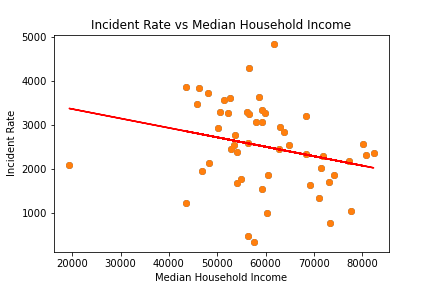
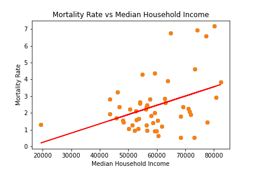

# Covid and Society

The Git Branch Covidians:

- Tempest Campbell
- Nick Faber
- Teresa Flicek
- Patrick Hudson
- Stuart Yates

### Overview

In the face of the greatest global pandemic since 1919, data scientists have rolled up their sleeves and gotten to work collecting and analyzing data from all corners of the world. For this project, we each picked a topic of interest and looked for datasets to compare with data on Covid-19, mostly from Johns Hopkins. Below are some of our findings.

### Obesity and Food Deserts

Question 1: How does each variable related to food deserts or obesity nationwide?

Conclusion: Each variable tends to have a positive correlation to the confirmed cases and deaths across the USA. As well, each scatter plot comes with a relatively high r-squared value which signifies a high correlation between the two variables. This tells me that overall health is extremely important in terms of how deadly COVID-19 is. Poor health has been positively linked to a higher death rate by scientists so this wasn't extremely shocking to me. What did interest me initially was the extremely high correlation between the amount of convenience stores and the number of confirmed cases (r-squared of 0.895). I later realized this might have to do more with the fact that a greater number of convenience stores means a higher population in said state, meaning a greater percentage of confirmed and deaths. 

What's next?: Due to the last realization that more convenience stores = more confirmed cases / deaths due to population size or density, I decided to look at each variable in per capita to see if this would result in less of a bias towards a state's population.

Question 2: How does each variable related to food deserts or obesity nationwide when converted into per capita statistics?

Conclusion: Again, each variable tends to have a positive correlation to the confirmed cases and deaths across the USA. Without the r-squared value, I am unable to see exactly how the variables correlate to each other and if they relate closely. Overall, I feel as if I was unable to come to a firm conclusion for the per capita stats. Given time, I do think there will be a general positive correlation between the variables.

What's next?: Due to time constraints, I wasn't able to see my idea to its full potential. Given more time, I would want to compare confirmed cases and deaths to convenience store locations around the nation and in specific states (top 5, bottom 5 for confirmed cases/deaths) using a heatmap or similar visual. I believe this would prove fruitful as it would give an indication has to what populations are contracting / dying from COVID-19 at a higher rate and their general location in relation to convenience stores or grocery stores.

### Faith in Science

What kinds of impacts does people's trust in scientists and health professionals have on prevalance of Covid-19 in their communities?

For this analysis, I mainly looked at 2 surveys:

- Yale data on climate change beliefs to measure trust in science
- NY Times data on estimated mask usage to measure trust in health authorities
- Vaccination data from the CDC

In general, the correlations I was looking for were very weak:

R-squared: 0.066

R-squared: 0.022

I wasn't expecting much more to be honest. There are so many other factors affecting exposure, and the data from initial hotspots like New York certainly muddies the waters. (I attempted some outlier scrubbing, but that only helped a little bit.) Perhaps in a year it will have regressed to the mean somewhat, but at this stage of the pandemic, there's too much signal to noise. Null hypothesis not disproved.

As for vaccines, the CDC data is available as a DAT file containing a lot of numbers. They supply you with some R scripts to turn it into an RData file, and a PDF descibing all the columns. It seemed excessive, but I went ahead and set up an R environment, managed to run the scripts, and used a package called Rio to output a CSV. Unfortunately, the data wasn't what I thought it was, so I ended up abandoning that analsysis.

### Income

In this portion of the project I looked into COVID-19 key metrics concerning cases, incidence, mortality, and testing data to see if median family income per state, wealthier vs poorer states, to see if an correlations could be attained. My hypothesis entering the research was that median income of a state might play a role in determining how an individual state is preforming overall in terms of previously mentioned health metrics during the pandemic. After completeing some analysis of the data I was able to uncover some correlation between the data and median income. The cumulative rates for mortality, incident rate, and testing rates, all showed either a positive or negative correaltion with state median income. 

As a general trend the wealthier states had overall lower incident rates and greater levels of testing completed than those on the lower end of the scale.

As depicted there is a correlation just none which are very strong.

However the mortaility rate stands out in opposition to those values tending to be higher in the wealthy states. 

This difference was likely the result of many factors, but highlights the socioeconimic complications of the pandemic. With a lack of an overall federal response to the pandemic, the states have been left to bare the burden of the costs of responding to the crisis. As a result the wealthier states tend to be fairing better overall outside of the initial deadly first months of the pandemic. 

### Alcohol Sales

Utilizing the dataset from the National Institute on Alcohol Abuse and Alcoholism and the covid dataset from Johns Hopkins, I wanted to see if there was any correlation between the alcohol sales in the US and the number of confirmed covid cases, the number of covid deaths, and the testing rate for the states included in the alcohol sales dataset.

Furthermore, I wanted to see if there was an increase in alcohol sales in 2020 compared to the past 3 years (2017-2019).

Based on my findings, I can conclude that:
Alcohol sales per capita did not have a significant correlation with the number of confirmed covid cases as the r2 value is .004. 

Alcohol sales per capita did not have a significant correlation with the number of confirmed covid deaths as the r2 value is .002. 

Alcohol sales per capita did not have a significant correlation with the testing rate of US states as the r2 value is .013.

It can also be concluded that there was an increase in alcohol sales per capita for 2020 compared to the previous three years as seen in the included line plot.

### Unemployment
#### Is the Colorado Unemployment rate in line with the National Unemplyment rate?
When looking at the unemployment data, I was able to find that the Colorado and National Unemployment data was corelated via a line graph and a scatter plot. I wanted to see if the Colorado unemployment was a good sample of the national unemployment data.

#### Is there a direct correlation with the Colorado Unemployment rate and the National Unemployment Rate?
When looking at the scatter plot for the unemployment data, there was a correlation of the r-value of 0.9 which meant that Colorado was a good sample size for the national data set.

#### Is there a correlation between confirmed cases and deaths from COVID-19?
When looking at the scatter plot for the COVID-19 data, there was a correlation of the r-value of 0.6 which meant that there was a strong correlation between cases and deaths.

#### Is there a relation between unemployment rates and covid cases?
When working with this data, I realized that I needed a new data set to match the unemployment data I had in order to compare the two data sets. Time was not on my side for searching for new/more data. 
